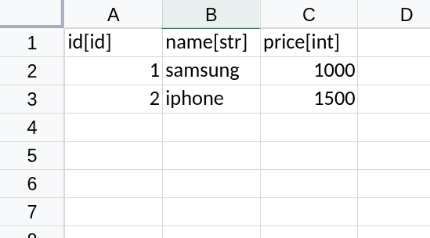

# Convert your sqlite database into excel

### Introduction 
This is small project for one use case: Transform your database into excel for no dev person

### How to work
1. take your sqlite to input file
2. Read your database with `sqlite3`
3. Create a dataframe for every table (`pandas` dataframe)
4. Create single excel file (one table -> one sheet)

### Usage

```python
from  Chore.SqliteConverter import SqliteConverter

# Sqlite to Excel
SqliteConverter.to_excel(
    "db.sqlite", 
    "output/data.xlsx"
)

# Excel to Sqlite
SqliteConverter.from_excel(
    "output/data.xlsx", 
    "output/db.sqlite"
)

```

### Excel file convention



##### All types avalaibles

| Syntax | Sqlite Signification |
|--------|----------------------|
| id     | INTEGER PRIMARY KEY AUTO INCREMENT |
| str    | TEXT NOT NULL |
| int    | INTEGER NOT NULL |
| real   | REAL NOT NULL |


*UI interface is not avalaible (use python script in `main.py`)*